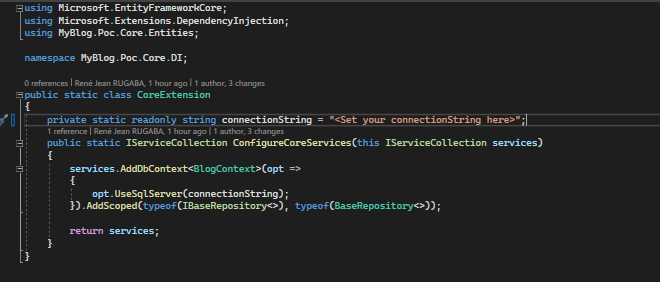

# Welcom to MyBlog.Poc 👋

[](#)
[](https://twitter.com/JeanRugaba)

> This solution aims to show the benefit of using the **Specification** and **Repository** design patterns.

### Project setup

> Open the solution in your favorite IDE and find the DI folder in the **MyBlog.Poc.Core** project.In the **CoreExtension** class you will find a private property. Assign your connection string to it.



### Run project

> Open your command line interface at the root of the project and use this command below.
 ```sh
dotnet run --project .\MyBlog.Poc\MyBlog.Poc.csproj 
```

>After running this command, the database will be created and a dataset will have been injected into each of its tables.

> Have fun 😄

## Author

👤 **RJ**

* Twitter: [@JeanRugaba](https://twitter.com/JeanRugaba)
* Github: [@ReneRugaba](https://github.com/ReneRugaba)
* LinkedIn: [@rene jean rugaba](https://www.linkedin.com/in/ren%C3%A9-jean-rugaba-66686a195)

## Show your support

Give a ⭐️ if this project helped you!


